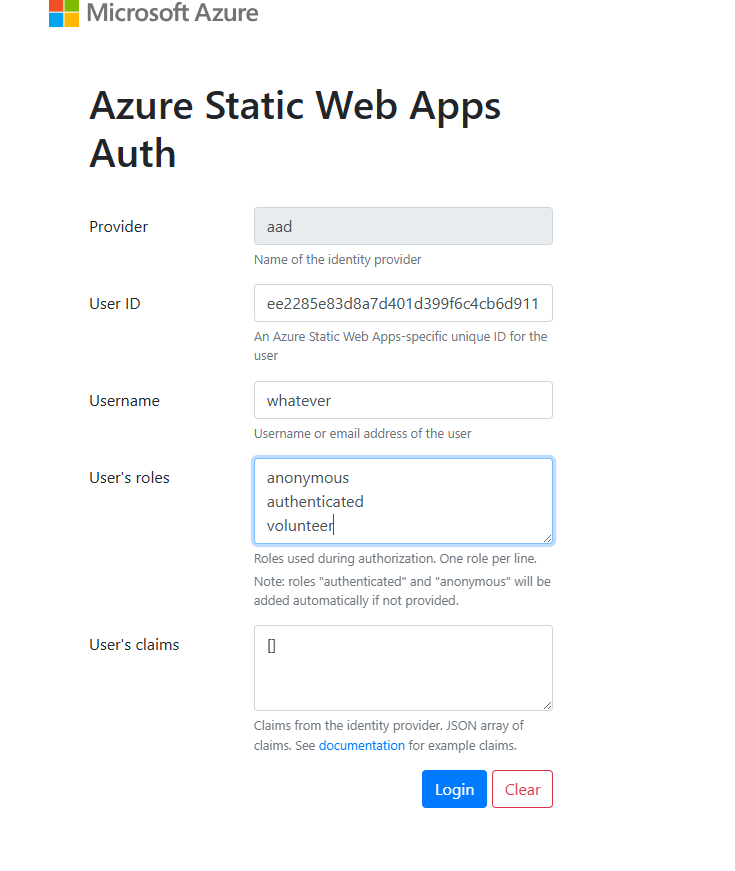

# Local Development with Docker

> **Status: proposed.** This document describes the Docker setup we intend to build. The files it refers to (`.devcontainer/`, `.vscode/tasks.json`) do not exist yet. Review this document first; the implementation will follow it.

## Introduction

This guide sets up everything you need to work on the app inside Docker containers: the code, Node, the API layer (Data API Builder, "DAB") and the SQL database. You open the repo in VS Code as a **dev container**, and VS Code builds the containers, creates and fills the database, and starts the app. You don't install SQL Server, .NET, PowerShell, Node or the DAB CLI on your machine.

The code lives in a **Docker volume**, not in a folder on your machine. Everything that runs during development, including every `npm install`, runs inside a container.

If you'd rather install everything on your machine directly, the original guides still work: [database-setup.md](database-setup.md), [DAB-setup.md](DAB-setup.md) and [swa-setup.md](swa-setup.md).

### How the pieces fit together

```
 VS Code (on your PC)
   │  terminal, editor, port forwarding
   ▼
 ┌──────────────────────────────────────────────┐        ┌──────────────┐
 │ app  (the dev container)                     │        │ sql          │
 │  /workspaces/plymouth-housing  ← Docker volume│  SQL   │ SQL Server   │
 │  SWA CLI + Vite  :4280  (the app)            │───────▶│ 2022         │
 │  DAB             :5000  (the REST API)       │        │ :1433        │
 │  PowerShell + bootstrap_db.ps1 (DB setup)    │        └──────────────┘
 └──────────────────────────────────────────────┘
```

| Container | What it does |
|---|---|
| `app` | Your dev container. It holds the code (in a Docker volume) and has Node 22, the SWA CLI, the DAB CLI and PowerShell. VS Code's terminal runs here. The app (SWA CLI + Vite) and DAB run here as two processes that VS Code starts for you. |
| `sql` | SQL Server 2022. Its data is kept in its own Docker volume, so it survives restarts and rebuilds. |

VS Code **forwards ports** from the containers to your PC: http://localhost:4280 for the app, http://localhost:5000/swagger for the API. Nothing is published on your network, and nothing listens on your machine except through VS Code.

---

## Prerequisites

You need:

1. **Docker Engine.**
   - **Windows:** Docker Engine installed **inside WSL**, in rootless mode. See [Windows: Docker inside WSL](#windows-docker-inside-wsl) below.
   - **macOS:** [Docker Desktop](https://www.docker.com/products/docker-desktop/).
   - **Linux:** [Docker Engine](https://docs.docker.com/engine/install/) with the Compose plugin. Rootless mode ([Step 6](#step-6-switch-docker-to-rootless-mode) below) is recommended here too.
2. **Git and a GitHub login** on the machine that runs Docker. See [Git and GitHub](#git-and-github).
3. **[Visual Studio Code](https://code.visualstudio.com/download)** with the **Dev Containers** extension. On Windows, also see [Step 7](#step-7-connect-vs-code-to-your-distro) for connecting VS Code to WSL.

> **Apple Silicon Mac users (M1 and later):** the SQL Server image is built for Intel. In Docker Desktop, open **Settings → General** and turn on **"Use Rosetta for x86_64/amd64 emulation on Apple Silicon"**. SQL Server will start more slowly than on other machines, but it works.

### Windows: Docker inside WSL

On Windows, Docker runs inside WSL (Windows Subsystem for Linux), in an Ubuntu distro. We don't use Docker Desktop. Running Docker Engine inside the distro keeps everything in one place and works with WSL's links to Windows turned off (see [Step 3](#step-3-optional-limit-what-wsl-can-do-on-windows)).

We run Docker in **rootless mode**: the Docker daemon and the containers run as your own Linux user instead of as root. If a container or a malicious package is compromised, it doesn't get root in your distro, and so it can't undo the settings in Step 3.

Unless a step says PowerShell, run commands in an **Ubuntu terminal**.

#### Step 1: Install WSL with Ubuntu

In a PowerShell window **run as Administrator**:

```powershell
wsl --install -d Ubuntu-24.04
```

Restart Windows if asked, then open **Ubuntu** from the Start menu and create your Linux username and password.

If you already use WSL, consider creating a fresh distro for your development work rather than reusing an old one with leftovers in it. On recent WSL versions you can give it a name (run `wsl --update` first if `--name` isn't recognized):

```powershell
wsl --install -d Ubuntu-24.04 --name dev
```

To see which distro a terminal is in, run `echo $WSL_DISTRO_NAME`. All distros show the same name in the prompt by default (your Windows computer name); Step 2 shows how to change that.

#### Step 2: Make sure systemd is on

Docker runs as a systemd service. Recent Ubuntu installs have systemd on already. Check:

```bash
systemctl is-system-running
```

If this prints `running` or `degraded`, go to Step 3. Otherwise, open `/etc/wsl.conf` in the nano editor (it asks for your Linux password):

```bash
sudo nano /etc/wsl.conf
```

Add these lines, keeping anything already in the file:

```ini
[boot]
systemd=true
```

Save with `Ctrl+O` then `Enter`, and exit with `Ctrl+X`. To paste into the terminal, right-click.

Then run `wsl --shutdown` in PowerShell and reopen Ubuntu.

**Optional: give the distro its own name in the prompt.** Every distro uses your Windows computer name as its hostname, so two distros look identical in the terminal (`you@your-pc`). To tell them apart, add this to `/etc/wsl.conf` with your own choice of name:

```ini
[network]
hostname=dev
```

After `wsl --shutdown` and reopening, the prompt shows `you@dev`.

#### Step 3 (optional): Limit what WSL can do on Windows

By default, any program running in WSL can **start Windows programs as you** (this is called "interop") and **read and write your Windows files** through `/mnt/c`. So a malicious npm package that runs in WSL can do almost anything you can do on Windows. This project has hundreds of npm dependencies, so this is a real risk.

To turn both off, open `/etc/wsl.conf` again with `sudo nano /etc/wsl.conf` and make it look like this. Keep the `[boot]` section from Step 2, and any `[user]` section Ubuntu added:

```ini
[boot]
systemd=true

[user]
default=your-linux-username

[interop]
enabled=false
appendWindowsPath=false

[automount]
enabled=false
```

Save and exit (`Ctrl+O`, `Enter`, `Ctrl+X`), then run `wsl --shutdown` in PowerShell and reopen Ubuntu. To check: `ls /mnt/c` should now say "No such file or directory" or show an empty folder.

What still works: opening the app in your Windows browser, and Windows reaching into WSL (for example `\\wsl$\` paths in File Explorer). What stops working:

- Running Windows programs from the Ubuntu terminal, such as `code .`, `explorer.exe .` or `clip.exe`.
- Your `C:` drive at `/mnt/c`.
- **VS Code's WSL extension and its "execute in WSL" Dev Containers mode.** Both translate Windows paths with `wslpath`, which needs the `C:` drive mounted. They fail with `wsl: Failed to translate 'c:\Users\...'` and "VS Code Server for WSL closed unexpectedly." [Step 7](#step-7-connect-vs-code-to-your-distro) shows how to connect VS Code over SSH instead.

These settings only hold as long as nothing gets root in your distro, because root can change `/etc/wsl.conf`. Rootless Docker (Step 6) and a `sudo` password help keep it that way.

#### Step 4: If Docker Desktop is installed, uninstall it

Skip this step if you've never installed Docker Desktop.

Docker Desktop would compete with the Docker Engine in your distro for the `docker` command and for ports, and it leaves settings behind that break Docker Engine. Uninstall it from **Windows Settings → Apps → Installed apps → Docker Desktop → Uninstall**. This deletes all containers and data inside Docker Desktop, so first back up anything you need.

Then, in PowerShell, check that its WSL distros are gone:

```powershell
wsl -l -v
```

If `docker-desktop` (or `docker-desktop-data`) is still listed, remove it, then restart WSL:

```powershell
wsl --unregister docker-desktop
```

```powershell
wsl --shutdown
```

Finally, in Ubuntu, remove the links and settings Docker Desktop left in your distro. Check for leftover links first:

```bash
ls -l /usr/bin/docker*
```

Remove any that point to `/mnt/wsl/docker-desktop/...` or `/Docker/host/...`, for example:

```bash
sudo rm /usr/bin/docker /usr/bin/docker-compose /usr/bin/docker-credential-desktop.exe
```

Docker Desktop also leaves a `~/.docker` folder that tells Docker to fetch credentials from a Windows program. Move it out of the way; Docker creates a fresh one:

```bash
mv ~/.docker ~/.docker.desktop-backup
```

#### Step 5: Install Docker Engine

These commands follow Docker's official [Ubuntu install guide](https://docs.docker.com/engine/install/ubuntu/). If anything here doesn't work, that guide is the source of truth.

Add Docker's package repository:

```bash
sudo apt-get update
sudo apt-get install -y ca-certificates curl
sudo install -m 0755 -d /etc/apt/keyrings
sudo curl -fsSL https://download.docker.com/linux/ubuntu/gpg -o /etc/apt/keyrings/docker.asc
sudo chmod a+r /etc/apt/keyrings/docker.asc
echo "deb [arch=$(dpkg --print-architecture) signed-by=/etc/apt/keyrings/docker.asc] https://download.docker.com/linux/ubuntu $(. /etc/os-release && echo "${UBUNTU_CODENAME:-$VERSION_CODENAME}") stable" | sudo tee /etc/apt/sources.list.d/docker.list > /dev/null
```

Install Docker Engine, the Compose plugin, and the extra packages rootless mode needs:

```bash
sudo apt-get update
sudo apt-get install -y docker-ce docker-ce-cli containerd.io docker-buildx-plugin docker-compose-plugin docker-ce-rootless-extras uidmap dbus-user-session
```

#### Step 6: Switch Docker to rootless mode

These steps follow Docker's [rootless mode guide](https://docs.docker.com/engine/security/rootless/).

The installer started a Docker daemon that runs as root. Turn it off:

```bash
sudo systemctl disable --now docker.service docker.socket
```

```bash
sudo rm -f /var/run/docker.sock
```

Set up rootless Docker for your user. Run this **without** `sudo`:

```bash
dockerd-rootless-setuptool.sh install
```

Tell the `docker` command to use it:

```bash
docker context use rootless
```

Let your rootless Docker keep running when no terminal is open, so containers don't stop when you close Ubuntu:

```bash
sudo loginctl enable-linger $USER
```

Check that it works:

```bash
docker run --rm hello-world
```

You should see `Hello from Docker!`. To confirm you're in rootless mode:

```bash
docker info --format '{{.SecurityOptions}}'
```

The output should include `name=rootless`.

> **Don't add yourself to the `docker` group.** Many guides tell you to. Members of that group control the root Docker daemon, which effectively gives them root on the distro, and that defeats the point of rootless mode. If you're already in it, leave it with `sudo gpasswd -d $USER docker` and open a new terminal.

#### Step 7: Connect VS Code to your distro

VS Code runs on Windows and connects to your distro to work on files and run containers there.

**If you skipped Step 3**, use the **WSL** extension: install it, then press `Ctrl+Shift+P` and run **WSL: Connect to WSL using Distro...** and pick your distro. The bottom-left corner shows `WSL: <distro>`. You're done with this step.

**If you followed Step 3**, the WSL extension doesn't work (see above). Connect over SSH instead: you run a small SSH server in the distro that only accepts connections from your own PC, and VS Code's **Remote - SSH** extension connects to it. To VS Code, your distro then looks like any remote Linux machine.

The examples below use `dev` as the distro name and `you` as your Linux username. Replace both with your own (`echo $WSL_DISTRO_NAME` and `whoami` in the distro).

**7a. Install the SSH server** (in the distro):

```bash
sudo apt-get update && sudo apt-get install -y openssh-server netcat-openbsd
```

**7b. Restrict it to your own PC, port 2222, and keys only.** Create a settings file:

```bash
sudo nano /etc/ssh/sshd_config.d/10-local-only.conf
```

Paste this, replacing `you` with your Linux username, then save and exit (`Ctrl+O`, `Enter`, `Ctrl+X`):

```
ListenAddress 127.0.0.1
Port 2222
PasswordAuthentication no
KbdInteractiveAuthentication no
PermitRootLogin no
AllowUsers you
```

Ubuntu 24.04 starts SSH through systemd, so reload it:

```bash
sudo systemctl daemon-reload && sudo systemctl restart ssh.socket
```

Check that it's listening on `127.0.0.1:2222`:

```bash
ss -ltn | grep 2222
```

**7c. Create a key on Windows.** In PowerShell (press `Enter` at the passphrase prompt, or set one):

```powershell
ssh-keygen -t ed25519 -f $env:USERPROFILE\.ssh\wsl_dev
```

Check that you now have two **files**, `wsl_dev` and `wsl_dev.pub`:

```powershell
Get-ChildItem $env:USERPROFILE\.ssh
```

**7d. Give the distro your public key.** In PowerShell, replacing `dev` with your distro name:

```powershell
Get-Content $env:USERPROFILE\.ssh\wsl_dev.pub | wsl -d dev -e sh -c "mkdir -p ~/.ssh && chmod 700 ~/.ssh && cat >> ~/.ssh/authorized_keys && chmod 600 ~/.ssh/authorized_keys"
```

**7e. Tell Windows how to reach the distro.** In PowerShell:

```powershell
notepad $env:USERPROFILE\.ssh\config
```

Add this, replacing `dev` (three times) and `you`, and **save** before you go on:

```
Host dev
  HostName 127.0.0.1
  Port 2222
  User you
  IdentityFile ~/.ssh/wsl_dev
  ProxyCommand C:\Windows\System32\wsl.exe -d dev -e nc 127.0.0.1 2222
```

The `ProxyCommand` line sends the connection through `wsl.exe`, which also **starts the distro if it isn't running**.

> Notepad sometimes saves this as `config.txt`. If `Get-ChildItem $env:USERPROFILE\.ssh` shows `config.txt`, rename it: `Rename-Item $env:USERPROFILE\.ssh\config.txt config`.

**7f. Test the connection.** In PowerShell:

```powershell
ssh dev
```

Type `yes` the first time it asks about the host. You should land at your distro's prompt. Type `exit`.

**7g. Connect VS Code.** In VS Code on Windows:

1. Install the **Remote - SSH** extension.
2. If the **WSL** extension is installed, **disable** it. Otherwise it keeps offering to reopen folders "in WSL", which fails.
3. Press `Ctrl+Shift+P`, run **Remote-SSH: Connect to Host...** and pick `dev`. If asked for the platform, choose **Linux**.

The first connection takes a minute while VS Code installs its server in the distro. The bottom-left corner shows `SSH: dev`. Next time, use **File → Open Recent**.

**If it doesn't work:**

- `ssh: Could not resolve hostname dev`: Windows didn't read your config. Make sure the file is called `config`, not `config.txt`, and that you saved it. `ssh -G dev | Select-String "^hostname|^port"` should show `hostname 127.0.0.1` and `port 2222`.
- `Permission denied (publickey)`: the key didn't reach the distro. Check `cat ~/.ssh/authorized_keys` in the distro and repeat 7d.
- `Connection refused`: the SSH server isn't listening. Repeat the restart command in 7b and check with `ss -ltn | grep 2222`.

### Git and GitHub

VS Code clones the repo and pushes your changes using the git login on the machine running Docker. On Windows that's your Ubuntu distro, so do this in your Ubuntu terminal. VS Code passes the login on to the dev container, so you don't log in again inside it.

Install git and the GitHub CLI (`gh`):

- **Windows (Ubuntu in WSL) and Linux (Ubuntu/Debian):**

  ```bash
  sudo apt-get update && sudo apt-get install -y git gh
  ```

- **macOS:** with [Homebrew](https://brew.sh/):

  ```bash
  brew install git gh
  ```

Tell git your name and email. These appear on your commits:

```bash
git config --global user.name "Your Name"
```

```bash
git config --global user.email "you@example.com"
```

Sign in to GitHub:

```bash
gh auth login
```

Choose **GitHub.com**, then **HTTPS**, then **Yes** to authenticate git, then **Login with a web browser**. If your browser doesn't open by itself (it won't if you followed Step 3 on Windows), open https://github.com/login/device in your browser and enter the one-time code `gh` shows you.

Check that it worked:

```bash
gh auth status
```

It should say `Logged in to github.com account <your username>`.

---

## First-time setup

### Step 1: Open the repo in a container volume

1. Open VS Code and connect it to the machine that runs Docker. **On Windows**, that's your WSL distro ([Step 7](#step-7-connect-vs-code-to-your-distro)); the bottom-left corner should show `SSH: <distro>` or `WSL: <distro>`. Run the next steps **in that window**, not in a local VS Code window. **On macOS and Linux**, a normal VS Code window is fine.
2. Install the **Dev Containers** extension in that window, if you haven't yet.
3. Press `Ctrl+Shift+P` (`Cmd+Shift+P` on macOS) and run **Dev Containers: Clone Repository in Container Volume...**.
4. Paste the repo URL:

   ```
   https://github.com/digitalaidseattle/plymouth-housing.git
   ```

   Or choose **GitHub** and pick the repo from the list.
5. Pick the branch you want to work on, usually `dev`.

VS Code now builds the containers. The first time takes several minutes: it downloads the images, installs the npm packages and the DAB CLI, and creates and fills the database. To watch, click **show log** in the notification at the bottom right. Later starts take seconds.

When it's done, the bottom-left corner shows `Dev Container: Plymouth Housing`.

### Step 2: Let VS Code start the app

The first time, VS Code asks whether to **allow automatic tasks** for this folder. Choose **Allow**. VS Code then opens two terminals and starts:

- **DAB**: wait for `Now listening on: http://localhost:5000`.
- **App**: wait for `Azure Static Web Apps emulator started at http://localhost:4280`.

If you missed the prompt, or the terminals don't appear, start them yourself: **Terminal → Run Task... → Start DAB**, then **Terminal → Run Task... → Start app**.

### Step 3: Log in to the app

1. Open **http://localhost:4280** in your browser.
2. You'll see the SWA mock login screen (this stands in for the Azure login used in production):

   

3. Type any username.
4. In **User's roles**, add **exactly one** role: `admin` or `volunteer`.
   - With no role, every API call fails.
   - With both roles, the app shows an error.
5. Click **Login**.

If you log in as a volunteer, the app asks you to pick a name and enter a PIN. The test volunteers' PINs are the numbers at the end of their names. For example, **John Doe 1234** has PIN **1234**. See [users_data.sql](../database/data_test/users_data.sql) for the full list.

You're set up. 🎉

### Reopening the project later

Use **File → Open Recent** (the entry ends in `[Dev Container]`), or the **Remote Explorer** in VS Code's left sidebar, which lists your dev containers and volumes. Your code, your database and any files you created are still there.

---

## Everyday use

All commands below run in VS Code's terminal (`` Ctrl+` ``), which is inside the `app` container.

| I want to… | Do this |
|---|---|
| Start or restart DAB (for example after editing `dab/dab-config.json`) | **Terminal → Run Task... → Start DAB**. If it's already running, first stop it with `Ctrl+C` in its terminal. |
| Start or restart the app | **Terminal → Run Task... → Start app** |
| Run the unit tests | `npm test` |
| Run the linter | `npm run lint` |
| Reinstall npm packages after `package.json` changes | `npm ci` |
| Browse the API | http://localhost:5000/swagger |
| Pick up changes to `.devcontainer/` | `Ctrl+Shift+P` → **Dev Containers: Rebuild Container**. Your code and database are kept. |

The API in Swagger is useful for seeing what endpoints exist. Most calls will fail from Swagger, though, because the app's requests carry login information that SWA adds (see [DAB-setup.md](DAB-setup.md#testing-the-api)).

### Working with the database

The **SQL Server (mssql)** extension is installed in the dev container, with a ready-made connection called **Plymouth local**. Open the SQL Server view in the left sidebar and pick it. The details, if you need them:

| Setting | Value |
|---|---|
| Server | `sql` (from inside the container) or `localhost,1433` (from tools on your PC, through VS Code's port forwarding) |
| Authentication | SQL Login |
| User | `sa` |
| Password | `Plymouth-Local-Dev-1`, unless you changed it (see [Configuration reference](#configuration-reference)) |
| Database | `Inventory` |
| Trust server certificate | Yes |

To run one script, for example a stored procedure you're editing, open the `.sql` file and click **Run** (or press `Ctrl+Shift+E`) with the **Plymouth local** connection.

### Files git doesn't track

Your code is in a Docker volume, so files that git ignores, such as `.env`, exist **only in that volume**. The app doesn't need any of them to run locally. If you add one, for example to try Application Insights, keep a copy somewhere safe: removing the volume removes the file.

---

## Changing the database

### Rebuilding the database from scratch

Do this after you pull changes that touch `database/`, or when your local data is in a bad state:

```bash
.devcontainer/init-db.sh --reset
```

This **deletes all data in your local `Inventory` database** and recreates it from the scripts in `database/`, using the same `bootstrap_db.ps1` as the non-Docker setup. It only affects your machine.

Without `--reset`, the script only creates the database if it doesn't exist yet. That's what runs automatically when the container is first built.

---

## Your code lives in a Docker volume

This is what keeps everything inside containers, but it changes a few habits:

- **Push often.** The volume is the only copy of work you haven't pushed. Deleting it deletes that work.
- **Be careful with cleanup commands.** `docker volume prune` and `docker system prune --volumes` delete volumes that no container is using, which can include your code. Leave out `--volumes` unless you mean it, and check `docker volume ls` first.
- **Rebuilding is safe.** **Dev Containers: Rebuild Container** replaces the containers but keeps the code volume and the database volume.
- **To find your files from outside VS Code**, use `docker volume ls`. The code volume's name starts with the repo name.

---

## Troubleshooting

### VS Code can't find Docker, or "Cannot connect to the Docker daemon"

Check in your distro's terminal (on Windows) or a terminal on your machine:

```bash
docker run --rm hello-world
```

If that fails with rootless Docker, start it with `systemctl --user start docker`, and check that `docker context ls` shows a `*` next to `rootless`.

If `docker` works in the terminal but VS Code still can't find it, point VS Code at the rootless Docker socket. Add this line to `~/.bashrc` in your distro:

```bash
export DOCKER_HOST=unix:///run/user/$(id -u)/docker.sock
```

Then in VS Code, close the remote connection (`Ctrl+Shift+P` → **Remote: Close Remote Connection**) and connect again.

On Windows, if `ls -l /usr/bin/docker` points to `/mnt/wsl/docker-desktop/...`, you're still using Docker Desktop's link. Follow [Step 4](#step-4-if-docker-desktop-is-installed-uninstall-it).

### "Command failed: wsl -d ... -e wslpath -u C:\Users\..."

VS Code tried to reach Docker in WSL from a local window, which needs the `C:` drive mounted in WSL (see [Step 3](#step-3-optional-limit-what-wsl-can-do-on-windows)).

- Run the command from the window connected to your distro: the bottom-left corner must show `SSH: <distro>`.
- If you ever added `dev.containers.executeInWSL` or `dev.containers.executeInWSLDistro` to your VS Code settings, remove them (`Ctrl+Shift+P` → **Preferences: Open User Settings (JSON)**).

### Building the container fails

Click **show log** in the notification, or run `Ctrl+Shift+P` → **Dev Containers: Show Container Log**. The last lines usually name the step that failed. After fixing the cause, run **Dev Containers: Rebuild Container**.

### The database wasn't created, or setup says it can't reach SQL Server

SQL Server takes up to a minute to start the first time. Run the setup again:

```bash
.devcontainer/init-db.sh
```

If it still fails, check SQL Server's logs: `Ctrl+Shift+P` → **Dev Containers: Show Container Log** and pick the `sql` container. If they mention the password policy, see [Changing the SQL password](#changing-the-sql-password).

### The app loads, but the data doesn't

- Make sure you logged in with **exactly one** role (`admin` or `volunteer`). To log in again, go to http://localhost:4280/.auth/logout.
- Look at the **Start DAB** terminal. If it isn't running, or shows connection errors, restart it.

### http://localhost:4280 doesn't open

Open the **Ports** tab next to VS Code's terminal. Ports `4280` and `5000` should be listed. If they're missing, click **Forward a Port** and add them. If port 4280 on your PC is taken by something else, VS Code forwards to a different local port; the **Ports** tab shows which.

### Starting over completely

1. `Ctrl+Shift+P` → **Dev Containers: Rebuild Without Cache Container**. This rebuilds the containers from scratch but keeps your code and database.
2. If the database volume itself is the problem, run `.devcontainer/init-db.sh --reset` instead.
3. Only as a last resort, delete the volumes (after pushing your work!) and go back to [Step 1](#step-1-open-the-repo-in-a-container-volume).

---

## Configuration reference

### Changing the SQL password

The local SQL Server uses the password `Plymouth-Local-Dev-1` by default. That's safe because SQL Server is only reachable from inside the dev container, and from your own PC through VS Code. To use your own password:

1. Create `.devcontainer/.env` (git ignores it) containing:

   ```
   MSSQL_SA_PASSWORD=Your-Own-Passw0rd
   ```

   SQL Server **refuses to start** with a weak password: use at least 8 characters, including three of these four: uppercase letters, lowercase letters, numbers, symbols.
2. SQL Server only reads the password when its volume is first created. Delete the database volume (`docker volume ls`, then `docker volume rm <name>` for the one ending in `sqlserverdata`), then run **Dev Containers: Rebuild Container**.

### Environment variables

These are set for you inside the `app` container:

| Variable | Value | Purpose |
|---|---|---|
| `DATABASE_CONNECTION_STRING` | points at `sql`, database `Inventory` | Used by DAB and by `bootstrap_db.ps1` |
| `DAB_HOST_MODE` | `development` | Detailed DAB errors |
| `MSSQL_SA_PASSWORD` | `Plymouth-Local-Dev-1`, or your own | SQL Server `sa` password |

Optional, in a `.env` file at the repo root: `VITE_APPINSIGHTS_CONNECTION_STRING` (leave empty locally).

### Files

| File | Purpose |
|---|---|
| `.devcontainer/devcontainer.json` | Tells VS Code how to build and open the dev container: the services, extensions, forwarded ports and setup commands. |
| `.devcontainer/docker-compose.yml` | Defines the `app` and `sql` containers and the database volume. |
| `.devcontainer/init-db.sh` | Waits for SQL Server, checks whether `Inventory` exists, and runs `database/bootstrap_db.ps1` if it doesn't (or always, with `--reset`). |
| `.vscode/tasks.json` | The **Start DAB** and **Start app** tasks, set to run when the folder opens. `.gitignore` gets an exception so this file is tracked. |

### Design notes

- **Two containers.** The `app` container has the code, so everything that needs the code runs there: the app, DAB and the database setup. Only SQL Server, which doesn't need the code, runs separately. This avoids sharing the code volume between containers.
- **One bootstrap script.** `init-db.sh` runs the existing `bootstrap_db.ps1` rather than a separate copy of its logic, so the Docker and non-Docker setups always build the same database.
- **Safe by default.** `bootstrap_db.ps1` drops the database. `init-db.sh` only runs it when `Inventory` doesn't exist, or when you explicitly pass `--reset`. Rebuilding containers never deletes data.
- **Same versions as production and CI.** The DAB CLI is pinned to the same version as the DAB image in Azure Container Apps (1.5.56 today). `sql` uses the `mcr.microsoft.com/mssql/server:2022-latest` image that CI uses.
- **No published ports.** Nothing is published on the Docker host; VS Code forwards ports to your PC. SQL Server and DAB can't be reached from other machines on your network, whatever your WSL or firewall settings.
- **Rootless Docker.** On Windows (and recommended on Linux), the containers run as your own user, not root. A compromised container or dependency doesn't get root on your machine.
- **Local only.** Nothing here changes how staging or production are built or deployed.

### Open questions for the implementation

- **The Python UI tests** ([e2e-automation-test.md](e2e-automation-test.md)) need Python and a browser. They're not part of this setup yet; adding them to the `app` container is a follow-up.
- **To verify when building:** that "Clone Repository in Container Volume" mounts the code volume into the `app` service as expected with a Compose-based dev container, and that SQL Server runs under rootless Docker.
