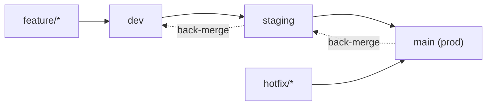

# CI/CD Improvement Plan

## Problem Statement

The current CI/CD setup has three issues:

1. **No stable test environment** — staging updates on every merge to `main`, so QA is testing against a constantly moving target.
2. **No preview environment** — feature branches only get CI (lint/test/build), never a live URL. Reviewers can't see changes running.
3. **Hotfixes are risky** — no clean path to patch prod without risking shipping unready dev work.

### Current setup (for reference)

- All branches except `main` → CI only (lint, test, build)
- Push to `main` → always deploys to staging slot
- Push to `main` + version bump in `package.json` → deploys to prod (with GitHub release + tag)
- E2E tests run after staging deployment

So staging is ahead of prod, but it moves on every single merge to `main`.

---

## Proposed Solution: Git Flow with mapped environments

### Branch flow

### Environment mapping

| Branch | Environment | Who uses it |
|---|---|---|
| `feature/*` PRs to `dev` | PR preview URLs (ephemeral, auto-created by Azure SWA) | Developers reviewing PRs |
| `dev` | Dev SWA (persistent) | Developers, internal demos |
| `staging` | Staging slot on existing prod SWA | QA / testers |
| `main` | Prod | Everyone |

### What this solves

- **Stable test env**: QA works against `staging`, which only updates when dev is deliberately promoted — not on every feature merge.
- **Preview environment**: Every PR to `dev` gets its own live URL automatically (Azure SWA does this natively).
- **Hotfixes**: `hotfix/*` → PR directly to `main` → deploy to prod → back-merge to `staging` and `dev` (see [hotfix-handling.md](../hotfix-handling.md)).

---

## What needs to change

### Azure (manual steps)

1. Create a new Azure Static Web App resource for the `dev` environment.
2. Copy its deployment token → add as GitHub secret `AZURE_STATIC_WEB_APPS_API_TOKEN_DEV`.
3. Create a dedicated DAB instance and Azure SQL database for dev.
4. Link the dev DAB to the dev SWA in Azure Portal → SWA → Settings → APIs.

> Staging already works as a named environment slot on the existing prod SWA — no new Azure resource needed for staging.

> **Current status**: Steps 3–4 are not yet done. The dev SWA is deployed but has no backend wired up — API calls will fail until a DAB + DB is provisioned and linked. If standing up a separate dev database is a blocker, a short-term fallback is to share the existing staging DAB, accepting that dev and staging data will not be isolated (see trade-offs below).

### Dev backend trade-offs

| Option | Pro | Con |
|---|---|---|
| Dedicated dev DAB + DB | Full isolation; DAB config changes in dev don't affect staging | Requires new Azure resources; DB needs seeding |
| Share staging DAB + DB | No new Azure resources needed | Dev data changes affect staging; DAB config changes in dev immediately affect staging QA |

PR preview environments (ephemeral per-PR) always share whichever backend is linked to the dev SWA — per-PR database isolation is not feasible with Azure SWA.

### GitHub Actions workflows

| File | Change |
|---|---|
| `azure-static-web-apps-dev.yml` | **New** — push to `dev` + PR previews for PRs targeting `dev`. Needs `AZURE_STATIC_WEB_APPS_API_TOKEN_DEV`. `api_location` is omitted — this project has no co-deployed Azure Functions API; the backend is DAB, which is a separately managed service. Dev SWA and all PR previews will point at the staging DAB instance. This means DAB config or schema changes merged into `dev` will not be reflected in the dev/preview environment until staging is updated — backend integration may break in previews. **This is an accepted trade-off.** If that becomes a problem, provisioning a dedicated dev DAB instance and linking it to the dev SWA would resolve it (see Dev backend trade-offs above). Include `VITE_CLARITY_PROJECT_ID` and `VITE_APPINSIGHTS_CONNECTION_STRING` env vars. |
| `azure-static-web-apps-CD.yml` | **Modify** — change trigger from `main` → `staging` branch. |
| `e2e-tests.yml` | **Modify** — update `workflow_run.branches` from `main` → `staging`. The trigger already uses `workflow_run: workflows: ["Azure Static Web Apps CD"]` with `types: [completed]` and an `if: conclusion == 'success'` guard, so it will naturally follow the CD workflow once the branch filter is updated. No structural change needed. |
| `azure-static-web-apps-prod.yml` | **No change** — stays triggered by `main` + version bump logic. |
| `azure-static-web-apps-CI.yml` | **No change** — already runs on all branches except `main`. |
| `azure-sql-CI.yml` | **No change** |

### New branches to create

- `dev` (from `main`)
- `staging` (from `main`)

Both should be set as protected branches in GitHub with:

- **Required PR reviews** (at least 1 approval)
- **Dismiss stale reviews** enabled (recommended) — ensures a new push after approval requires re-review
- **Required status checks** — require the following checks to pass before merge:
  - `build` (from `azure-static-web-apps-CI.yml`)
  - `lint` (from `azure-static-web-apps-CI.yml`)
  - `test` (from `azure-static-web-apps-CI.yml`)
