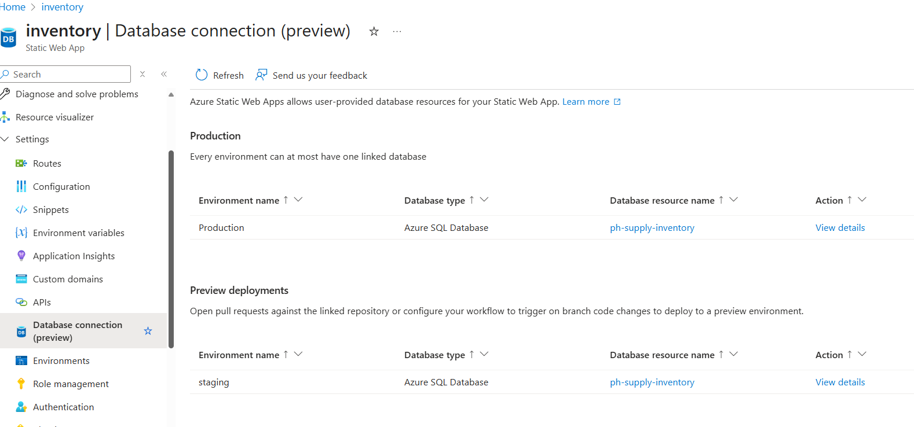
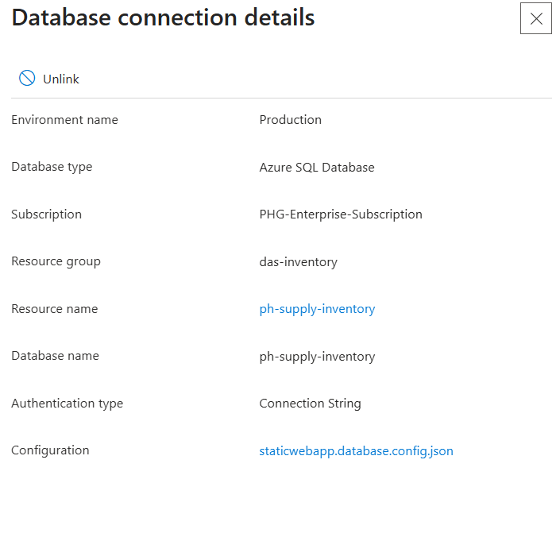
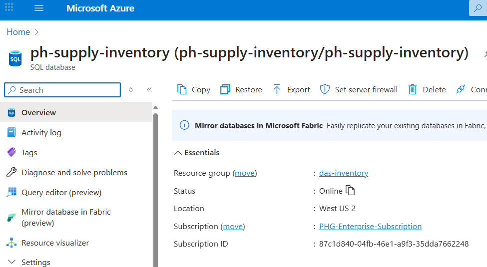
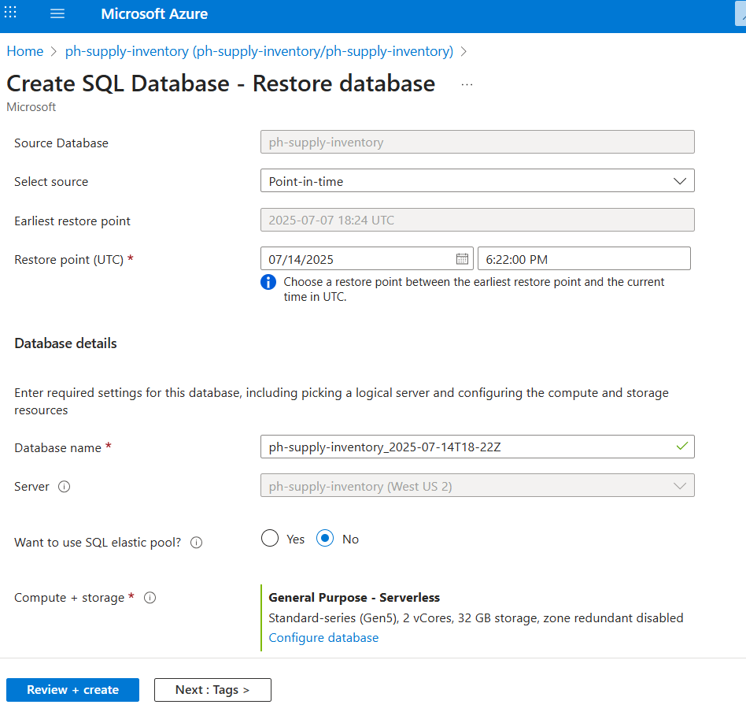
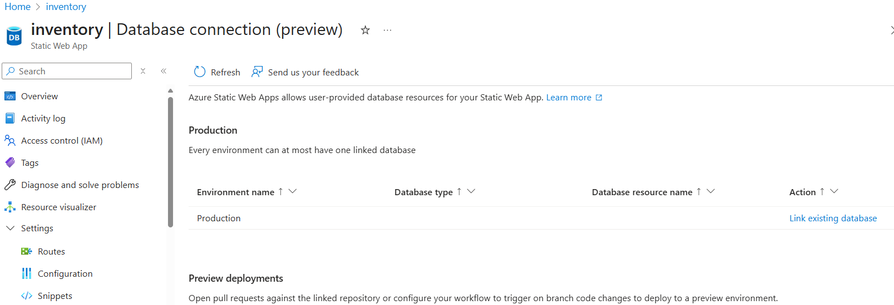

# Restore Azure SQL

## Introduction

## Steps

### Find Prod DB

1. Log into Azure Portal
1. Go to the Static Web App resource **inventory**

1. Select **Database connection (preview)** in the tree on the left. 
1. Under **Production** select **View Details** on the right under Action
    

The **Database name** is the name of the SQL production DB. 

### Restore the DB

1. Select the database that needs to be restored to an earlier point in time. 
    
1. Click Restore. 
    
1. In the next screen, leave all the defaults, except for:
    - Restore Point. Choose the time after which the data needs to be discarded. 
    - Database Name (optional)
1. Click Review and Create

This step will take 10-15 minutes. 

### Switch the Database

1. Go back to the screen of your Web App with the Database connection details. 
1. Click Unlink. 
1. Now you can click **Link existing database**
    
1. In the next screen, select your newly created database. 
1. The settings for SQL server are already good, so you can acknowledge with the checkbox and Link the database. 

Browse to the production web site and your website will now be using the restored version. 
