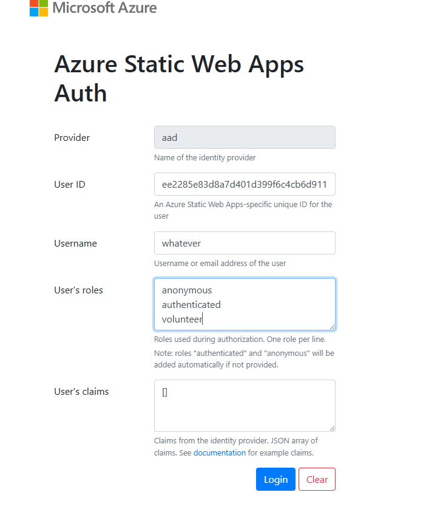

# Static Web App (SWA) Setup

## Overview

This project uses [Azure Static Web Apps](https://azure.microsoft.com/en-us/services/app-service/static/) to host the React frontend. The SWA CLI is used for local development to simulate the production environment.

## Prerequisites

- **Node.js and npm** installed ([Download here](https://docs.npmjs.com/downloading-and-installing-node-js-and-npm))
- **Azure SWA CLI** - Installed automatically via npm dependencies
- **Database and DAB running** - See [database-setup.md](database-setup.md) and [DAB-setup.md](DAB-setup.md)

## Local Development Workflow

1. **Ensure prerequisites are running:**
   - SQL Server database is running
   - DAB is running in a separate terminal: `dab start -c ./dab/dab-config.json`

2. **Start SWA CLI:**
   ```bash
   swa start
   ```

3. **Access the application:**
   - Frontend: `http://localhost:4280`
   - DAB API: Connected via SWA proxy (configured in `swa-cli.config.json`)

When you start SWA locally, you will get the logon screen below. In user name you can type anything you want.
You need to add **either** admin or volunteer to the User's roles. Without one of them, all API calls will fail.
With two of them, the app errors out.



## Configuration Files

### `swa-cli.config.json`

Configures the SWA CLI for local development:

```json
{
  "configurations": {
    "plymouth-housing": {
      "appLocation": ".",
      "outputLocation": "dist",
      "dataApiLocation": "swa-db-connections",
      "appBuildCommand": "npm run build",
      "run": "npm run dev",
      "appDevserverUrl": "http://localhost:3000"
    }
  }
}
```

## Additional Resources

- [Azure Static Web Apps Documentation](https://learn.microsoft.com/en-us/azure/static-web-apps/)
- [SWA CLI Documentation](https://azure.github.io/static-web-apps-cli/)
- [SWA Configuration Reference](https://learn.microsoft.com/en-us/azure/static-web-apps/configuration)
